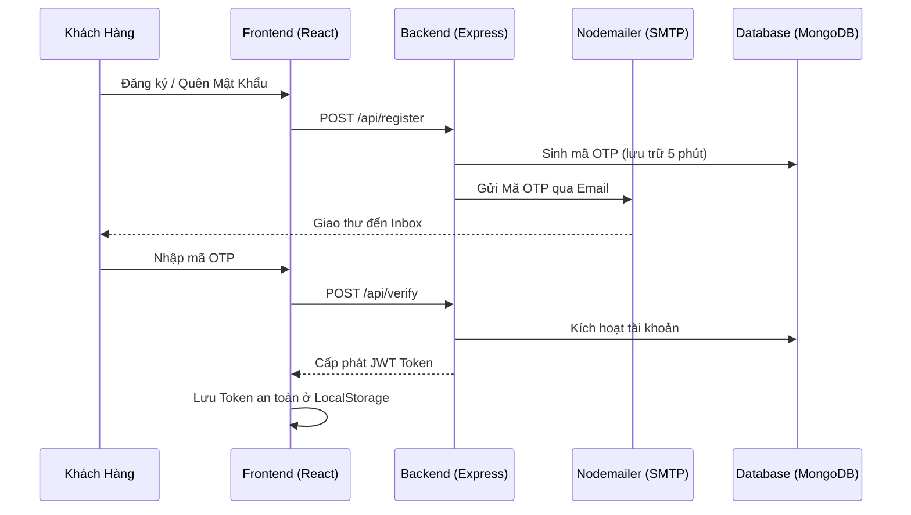

# 🛒 Báo cáo Kỹ thuật: Dự án HobbyShop (FigureCurator)

> 🚀 **Hệ thống E-Commerce toàn diện dành cho cộng đồng đam mê mô hình và đồ chơi sưu tầm.**

**Mục tiêu:** Cung cấp trải nghiệm mua sắm trực quan, mượt mà và an toàn cho khách hàng, đồng thời trang bị công cụ quản lý mạnh mẽ cho chủ cửa hàng.

---

## 🏗️ 1. Kiến trúc Tổng thể (Client-Server)

Hệ thống hoạt động dựa trên mô hình **Client-Server**, giao tiếp thông qua **RESTful API**.

```mermaid
graph TD;
    subgraph Frontend [Giao diện Người dùng (ReactJS)]
        C[Client Customer] -->|Mua sắm, Giỏ hàng, Pre-order| HTTP_Req
        A[Client Admin] -->|Quản lý Kho, Đơn hàng, Users| HTTP_Req
    end

    HTTP_Req[HTTP Requests / JSON] --> Express[Backend Server (ExpressJS + Node.js)]
    
    subgraph Backend [Hệ thống Xử lý Tầm trung (Node.js)]
        Express --> Auth[Middleware Xác thực (JWT)]
        Auth --> Logic[Xử lý Nghiệp vụ & Routing]
        Logic --> ODM[Mongoose ODM]
    end

    subgraph Database [Lưu trữ Dữ liệu (MongoDB)]
        ODM -->|Lưu/Đọc Data| DB[(MongoDB Atlas Cloud)]
    end
    
    style C fill:#4285F4,color:#fff,stroke:#fff
    style A fill:#EA4335,color:#fff,stroke:#fff
    style Express fill:#34A853,color:#fff,stroke:#fff
    style DB fill:#FBBC05,color:#fff,stroke:#fff
```

* **Client Customer (Khách hàng)**: Duyệt sản phẩm, lọc, tìm kiếm, quản lý giỏ hàng, đặt hàng (Pre-order), quản lý hồ sơ và theo dõi hạng thành viên.
* **Client Admin (Quản trị viên)**: Dashboard trung tâm quản lý sản phẩm, tồn kho, đơn hàng, người dùng và phân tích dữ liệu.

---

## 💻 2. Nền tảng Công nghệ (MERN Stack + Modern Tools)

Dự án áp dụng **MERN Stack** kết hợp các công cụ tối ưu hóa mới nhất để đảm bảo hiệu suất và trải nghiệm người dùng (UX) tuyệt vời nhất.

| Layer | Công nghệ | Vai trò & Tính năng nổi bật |
| :--- | :--- | :--- |
| **Frontend** | ⚛️ ReactJS (Vite, TypeScript, TailwindCSS) | Giao diện Single Page Application (SPA), render siêu nhanh, UI linh hoạt, code an toàn kiểm soát thông qua Typescript. |
| **Backend** | 🟢 Node.js & ExpressJS | API linh hoạt, kiến trúc Non-blocking I/O mạnh mẽ cho logic giỏ hàng và thanh toán đa luồng. |
| **Database** | 🍃 MongoDB & Mongoose | Cơ sở dữ liệu NoSQL mở rộng cực tốt, rất linh hoạt cho cấu trúc sản phẩm và đơn hàng phức tạp. |
| **Deployment**| ☁️ Vercel, Render, Atlas | Giải pháp Cloud tối ưu hoàn toàn miễn phí: Frontend tải nhanh (Vercel CDN), Backend hoạt động liên tục (Render + UptimeRobot). |

---

## ⚙️ 3. Phân tích Các Công nghệ Cốt lõi

### 3.1 Giao diện (Frontend)
- **Vite⚡:** Thay thế Webpack/CRA truyền thống. Vite mang lại thời gian khởi động (start server) tính bằng miligiây và build bundle siêu tốc dựa trên ES Modules gốc của trình duyệt.
- **ReactJS (SPA):** Cơ chế DOM Ảo (Virtual DOM) giúp cập nhật các thành phần độc lập (Ví dụ: cập nhật số lượng giỏ hàng) mà không cần tải lại toàn bộ trang web. Quản lý trạng thái cục bộ bằng Hooks (`useState`, `useEffect`) và điều hướng mượt mà với `react-router-dom`.
- **TypeScript:** Nâng cấp JavaScript bằng cách cung cấp "kiểu tĩnh" (static typing). Giúp báo lỗi ngay trong IDE khi gõ code, đặc biệt quan trọng để tránh lỗi logic với các cấu trúc lớn như mạng sản phẩm, giỏ hàng, thông tin thanh toán.
- **Tailwind CSS:** Framework CSS "Utility-first". Các class đã được biên dịch siêu nhỏ (`text-center`, `flex`, `lg:grid-cols-4`,...) đắp thẳng vào HTML giúp dựng giao diện Responsive nhanh chóng mà không làm hỗn loạn các file `.css` truyền thống.

### 3.2 Máy chủ (Backend)
- **Node.js:** Môi trường thực thi JavaScript bên ngoài trình duyệt. Kiến trúc Event-Driven, lý tưởng để phục vụ nhiều khách hàng cùng lúc mà không lo nghẽn mạng nhờ cơ chế bất đồng bộ.
- **ExpressJS:** Web Framework nhỏ gọn gọn nhẹ, thiết lập các API Endpoints (Ví dụ: `GET /api/products`, `POST /api/orders`) và áp dụng các lớp trung gian (Middleware) để kiểm soát quyền.

### 3.3 Cơ sở dữ liệu (Database)
- **MongoDB (Atlas Cloud Database):** Chứa các Data Record dưới dạng Document theo cấu trúc JSON. Rất phù hợp với E-Commerce vì tính linh động (Ví dụ Sản phẩm có thể có hoặc không cần thuộc tính `date-release`).
- **Mongoose ODM:** Thư viện ánh xạ Object thành Document. Hỗ trợ mạnh các truy vấn gộp qua Aggregation Pipeline (`$lookup`, `$match`, `$group`) để tính toán thông số phức tạp như hạng thành viên (Dựa vào tổng chi tiêu khách hàng).

---

## 🔐 4. Luồng xử lý Nghiệp vụ Tiêu biểu

### Luồng Xác thực & Bảo mật (JWT + OTP)


* **Bảo mật:** JWT hoạt động như "chiếc chìa khóa điện tử". Bất kỳ request nào cần lấy dữ liệu cá nhân đều phải đính kèm chuỗi JWT vào `Authorization Header`. Admin được ấn định role đặc biệt nhằm chặn truy cập trái phép.
* **Mã OTP:** Tối đa độ tin cậy bằng cách xác minh Email thông qua dịch vụ SMTP được tích hợp `Nodemailer`.

---

## 🛒 5. Kiến trúc luồng Mua Sắm & Thanh Toán (Checkout Flow)

Tính năng trung tâm của ứng dụng là trải nghiệm mua sắm không đứt đoạn.

```mermaid
flowchart LR
    A[Giỏ Hàng <br> (Cart Context)] -->|Khởi chạy Thanh toán| B(Trang Checkout)
    B --> C{Thu thập & Xác thực Dữ liệu}
    C -->|1. Sổ địa chỉ (Shipping)| D[Gom Dữ liệu thành Object]
    C -->|2. Phương thức (Payment Method)| D
    C -->|3. Lọc Item Giỏ hàng| D
    D -->|Post Payload qua API| E[Backend OrderDAO]
    E -->|Insert Document| F[(Lưu Order vào Collection MongoDB)]
    F -->|Đơn hàng thành công| G[Bắn Email Hóa Đơn Tự Động]
    F -->|Phản hồi OK| H[Frontend Reset Giỏ Hàng]
    style E fill:#f96,stroke:#333,stroke-width:2px,color:#000
    style F fill:#13AA52,color:#fff
```

---

## 🚀 6. Sơ đồ Triển khai Lên Mây (Cloud Deployment)

HobbyShop sử dụng một mạng lưới kiến trúc Micro-Cloud tối ưu, linh hoạt, đảm bảo sự ổn định mà có chí phí vận hành gần như bằng "0".

```mermaid
graph LR
    User(Người dùng truy cập) --> |HTTPS tốc độ cao| Vercel[☁️ Vercel CDN (Frontend)]
    Vercel --> |Trả về UI, JS, CSS| User
    Vercel --> |API Cross-Origin Request| Render[☁️ Render Web Service (Backend Node.js)]
    Render <--> |Mongoose Read/Write| Atlas[(☁️ MongoDB Atlas Cloud)]
    
    UR[🤖 UptimeRobot] --> |Ping liên tục mỗi 5 phút| Render
    
    style Vercel fill:#000,color:#fff,stroke:#fff
    style Render fill:#46E3B7,color:#000,stroke:#fff
    style Atlas fill:#13AA52,color:#fff,stroke:#fff
    style UR fill:#333,color:#fff,stroke:#fff
```
- **Vercel:** Nơi host App Frontend ReactJS. Cung cấp mạng phân phối nội dung (Global CDN) đem lại tốc độ load trang trong nháy mắt.
- **Render:** Nơi host Backend ExpressJS liên tục xử lý logic nghiệp vụ.
- **UptimeRobot:** Công cụ giám sát ngoại vi đóng vai trò "đánh thức" Server Render (tránh server miễn phí bị ngủ đông do ít truy cập).
- **MongoDB Atlas:** Dữ liệu hoàn toàn được quản lý tự động, đảm bảo toàn vẹn.
