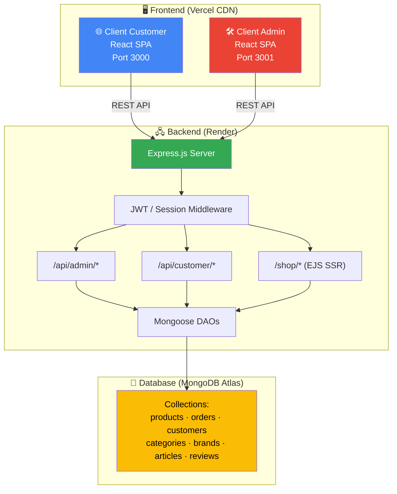
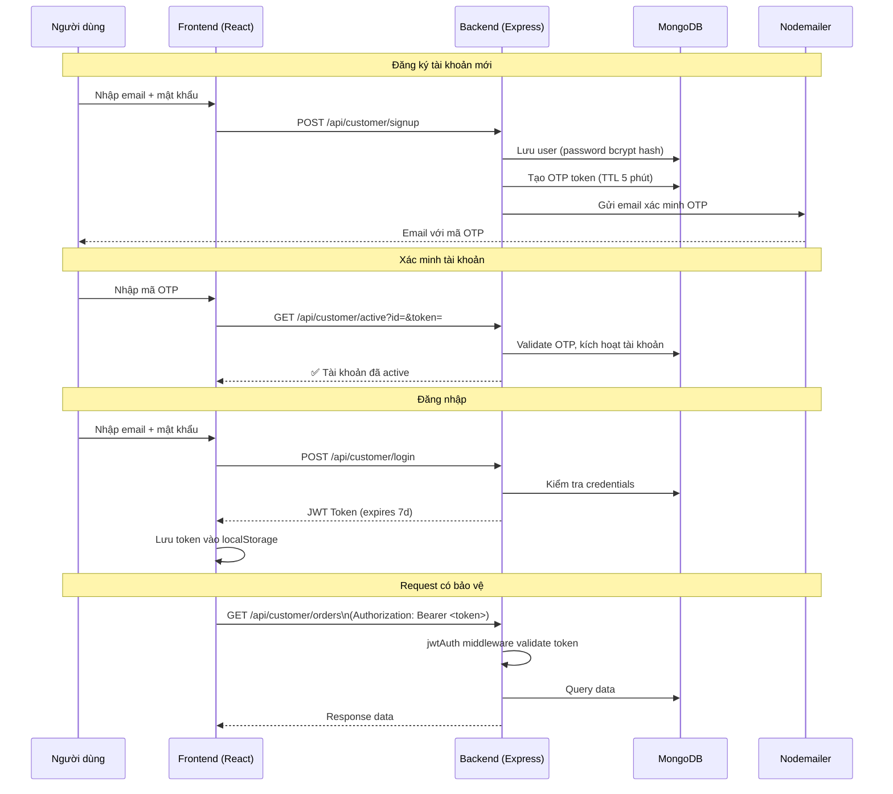
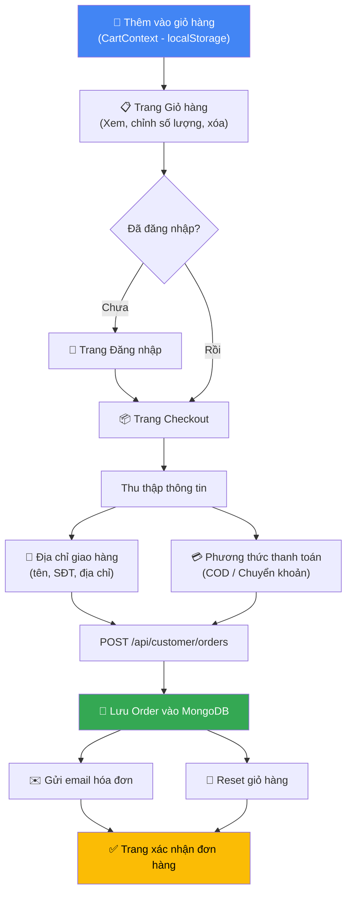
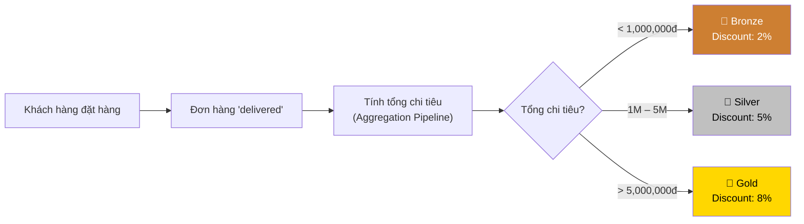

# 🏗️ Kiến trúc Hệ thống HobbyShop

> **Điều hướng nhanh:**
> [README](../README.md) · [Cấu trúc thư mục](./DIRECTORY_STRUCTURE.md) · [Công nghệ](./TECH_STACK.md) · [API](./API_REFERENCE.md) · [Triển khai](./DEPLOYMENT.md) · [Vấn đề & Giải pháp](./PROBLEM_SOLVING.md)

---

## 1. Tổng quan Kiến trúc

HobbyShop áp dụng mô hình **Client-Server** với kiến trúc **API-first**. Backend là một REST API độc lập, phục vụ đồng thời cho nhiều client khác nhau.

```
┌─────────────────────────────────────────────────────────┐
│                        CLIENTS                          │
│                                                         │
│  ┌──────────────────┐     ┌──────────────────┐          │
│  │  Customer Website│     │   Admin Panel    │          │
│  │  React SPA       │     │   React SPA      │          │
│  │  Port :3000      │     │   Port :3001     │          │
│  └────────┬─────────┘     └────────┬─────────┘          │
└───────────┼──────────────────────┼─────────────────────┘
            │  HTTP/JSON REST API  │
            └──────────┬───────────┘
                       ▼
┌─────────────────────────────────────────────────────────┐
│                     BACKEND SERVER                      │
│                                                         │
│  Express.js (Node.js) — Port :5000                      │
│  ┌─────────────┐  ┌──────────────┐  ┌───────────────┐  │
│  │  /api/admin │  │/api/customer │  │   /shop (EJS) │  │
│  └──────┬──────┘  └──────┬───────┘  └───────┬───────┘  │
│         └────────────────┼──────────────────┘           │
│                          ▼                              │
│              JWT Middleware / Session                   │
│                          │                              │
│              Business Logic (DAOs)                      │
│                          │                              │
│              Mongoose ODM                               │
└──────────────────────────┼──────────────────────────────┘
                           ▼
┌─────────────────────────────────────────────────────────┐
│                   DATABASE (MongoDB)                    │
│                                                         │
│  Collections:  products │ orders │ customers            │
│               categories │ brands │ articles │ reviews  │
└─────────────────────────────────────────────────────────┘
```

---

## 2. Sơ đồ Kiến trúc (Mermaid)



---

## 3. Luồng Xác thực (Authentication Flow)

Hệ thống sử dụng **JWT (JSON Web Token)** cho admin và **Session + JWT** cho customer.



---

## 4. Luồng Mua sắm & Thanh toán (Checkout Flow)



---

## 5. Luồng Hạng Thành viên (Membership Tier)



---

## 6. Cấu trúc Database Collections

### `products`
```json
{
  "_id": "ObjectId",
  "name": "Figure Goku Super Saiyan",
  "description": "...",
  "price": 850000,
  "category": "ObjectId → categories",
  "brand": "ObjectId → brands",
  "images": ["url1", "url2"],
  "stock": 15,
  "releaseDate": "2024-06-01",   // cho pre-order
  "isHot": true,
  "isNew": true,
  "status": "active"
}
```

### `orders`
```json
{
  "_id": "ObjectId",
  "customer": "ObjectId → customers",
  "items": [
    { "product": "ObjectId", "name": "...", "price": 850000, "quantity": 2 }
  ],
  "shippingAddress": {
    "fullName": "Nguyen Van A",
    "phone": "0901234567",
    "address": "123 Đường ABC, TP.HCM"
  },
  "paymentMethod": "COD",
  "totalAmount": 1700000,
  "status": "pending",           // pending|confirmed|shipping|delivered|cancelled
  "createdAt": "2026-04-01T..."
}
```

### `customers`
```json
{
  "_id": "ObjectId",
  "email": "user@example.com",
  "password": "$2b$...",         // bcrypt hash
  "fullName": "Nguyen Van A",
  "phone": "0901234567",
  "isActive": true,
  "otpToken": "...",
  "otpExpires": "Date",
  "membershipTier": "silver",    // bronze|silver|gold (tính động)
  "createdAt": "Date"
}
```

---

## 7. Giao tiếp Frontend ↔ Backend

### Config API URL
Mỗi client có file `src/config.ts`:
```typescript
// client-customer/src/config.ts
const API_URL = import.meta.env.VITE_API_URL || 'http://localhost:5000';
export default API_URL;
```

### CORS Setup (server)
```javascript
// server/index.js
app.use(cors({
  origin: [process.env.CLIENT_URL, process.env.ADMIN_URL],
  credentials: true
}));
```

### JWT Header
```typescript
// Frontend gửi kèm JWT trong mọi request cần auth
headers: {
  'Authorization': `Bearer ${localStorage.getItem('token')}`,
  'Content-Type': 'application/json'
}
```

---

*Điều hướng: [⬆️ Về README](../README.md) · [➡️ Công nghệ sử dụng](./TECH_STACK.md)*
